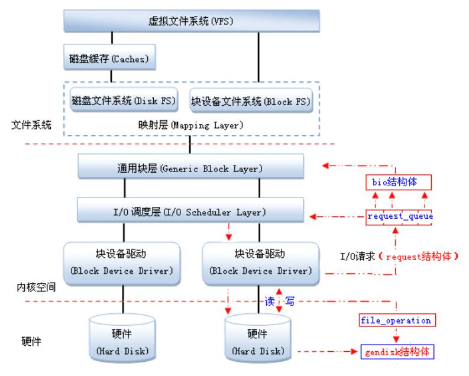
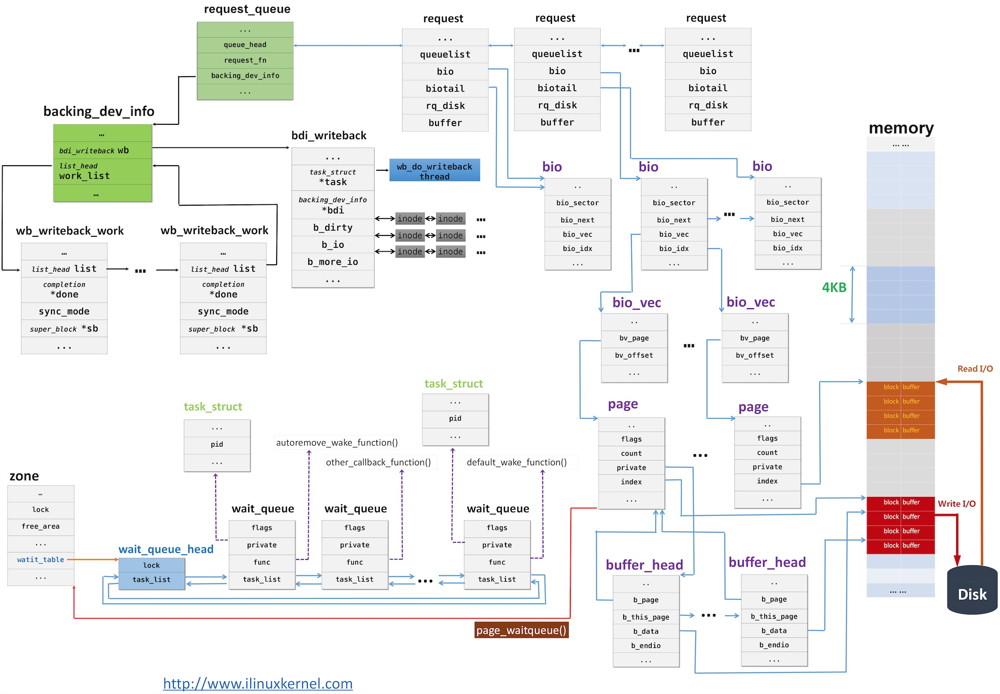

## Null Block Device

[nullblk](https://www.kernel.org/doc/html/latest/block/null_blk.html) 即 Null block device driver，空块设备（`/dev/nullb*`），用于对各种块层实现进行基准测试。它模拟 `X` GB 大小的块设备。**它不执行任何读/写操作**，只是在请求队列中将它们标记为完成，用于对各种 block-layer 实现进行基准测试。

nullblk 已经被合入 Linux Kernel 主线，具体用法可以参考[内核文档](https://www.kernel.org/doc/html/latest/block/null_blk.html)。

TODO: [nullblk 的工作原理分析](https://blog.csdn.net/jasonactions/article/details/109578901)






https://blog.csdn.net/weixin_34216107/article/details/92562214

<details> <summary>Null block device driver</summary>
<pre><code>
Null block device driver
==================================
I. Overview
The null block device (/dev/nullb*) is used for benchmarking the various
block-layer implementations. It emulates a block device of X gigabytes in size.
The following instances are possible:
  Single-queue block-layer
    - Request-based.
    - Single submission queue per device.
    - Implements IO scheduling algorithms (CFQ, Deadline, noop).
  Multi-queue block-layer
    - Request-based.
    - Configurable submission queues per device.
  No block-layer (Known as bio-based)
    - Bio-based. IO requests are submitted directly to the device driver.
    - Directly accepts bio data structure and returns them.
All of them have a completion queue for each core in the system.
II. Module parameters applicable for all instances:
queue_mode=[0-2]: Default: 2-Multi-queue
  Selects which block-layer the module should instantiate with.
  0: Bio-based.
  1: Single-queue.
  2: Multi-queue.
home_node=[0--nr_nodes]: Default: NUMA_NO_NODE
  Selects what CPU node the data structures are allocated from.
gb=[Size in GB]: Default: 250GB
  The size of the device reported to the system.
bs=[Block size (in bytes)]: Default: 512 bytes
  The block size reported to the system.
nr_devices=[Number of devices]: Default: 1
  Number of block devices instantiated. They are instantiated as /dev/nullb0,
  etc.
irqmode=[0-2]: Default: 1-Soft-irq
  The completion mode used for completing IOs to the block-layer.
  0: None.
  1: Soft-irq. Uses IPI to complete IOs across CPU nodes. Simulates the overhead
     when IOs are issued from another CPU node than the home the device is
     connected to.
  2: Timer: Waits a specific period (completion_nsec) for each IO before
     completion.
completion_nsec=[ns]: Default: 10,000ns
  Combined with irqmode=2 (timer). The time each completion event must wait.
submit_queues=[1..nr_cpus]:
  The number of submission queues attached to the device driver. If unset, it
  defaults to 1. For multi-queue, it is ignored when use_per_node_hctx module
  parameter is 1.
hw_queue_depth=[0..qdepth]: Default: 64
  The hardware queue depth of the device.
III: Multi-queue specific parameters
use_per_node_hctx=[0/1]: Default: 0
  0: The number of submit queues are set to the value of the submit_queues
     parameter.
  1: The multi-queue block layer is instantiated with a hardware dispatch
     queue for each CPU node in the system.
no_sched=[0/1]: Default: 0
  0: nullb* use default blk-mq io scheduler.
  1: nullb* doesn't use io scheduler.
blocking=[0/1]: Default: 0
  0: Register as a non-blocking blk-mq driver device.
  1: Register as a blocking blk-mq driver device, null_blk will set
     the BLK_MQ_F_BLOCKING flag, indicating that it sometimes/always
     needs to block in its ->queue_rq() function.
shared_tags=[0/1]: Default: 0
  0: Tag set is not shared.
  1: Tag set shared between devices for blk-mq. Only makes sense with
     nr_devices > 1, otherwise there's no tag set to share.
zoned=[0/1]: Default: 0
  0: Block device is exposed as a random-access block device.
  1: Block device is exposed as a host-managed zoned block device. Requires
     CONFIG_BLK_DEV_ZONED.
zone_size=[MB]: Default: 256
  Per zone size when exposed as a zoned block device. Must be a power of two.
zone_nr_conv=[nr_conv]: Default: 0
  The number of conventional zones to create when block device is zoned.  If
  zone_nr_conv >= nr_zones, it will be reduced to nr_zones - 1.
</code></pre>
</details>


可以说，使用 nullblk 并不能在仿真中测量系统的整体性能，它更多的是仿真了 Linux Kernel 中外存的队列执行情况。所以，使用 nullblk 只能用于测试代码能否跑通，并不能测量其具体性能指标等。

### nullblk 的使用和修改

由于 ZNS 实物申请需要一段时间，或者无法申请到，所以我们需要一个仿真环境来进行我们的开发流程。nullblk 可以仿真块设备，并可以设置为只能顺序写的模式，正好仿真 ZNS 中的硬件 Zones。

#### 使用 nullblk

在测试中，可以方便地用脚本调用 Linux Kernel 的系统调用来创建 nullblk。在之前的文档中，我们已经获取了 `nullblk-zoned.sh`，执行

```shell
sudo ./nullblk-zoned.sh 4096 128 64 64
```

则可以创建一个 8GiB 的仿真 ZNS 磁盘。

在代码中，ZenFS 依赖 `libzbd` 对下层 I/O 进行控制。


