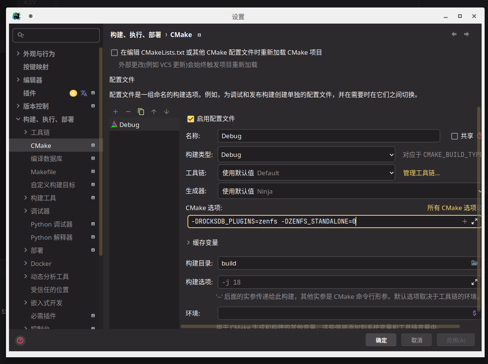

## Get Started

### Build

#### Standalone Mode

这个模式用于尽量剥离 RocksDB 相关代码逻辑，加快编译调试速度

*目前暂时不可用于读写性能测试*。

#### Plugin Mode

原 ZenFS 项目构建方式。

```shell
# 从我们 Fork 的项目 Clone，并且同时同步子项目
git clone https://github.com/RethinkFS/rocksdb -b aquafs --recursive
```

从命令行构建：

```shell
# 需要额外设置参数 ZENFS_STANDALONE=0
cmake -B build -S . -DROCKSDB_PLUGINS="aquafs zenfs" -DAQUAFS_STANDALONE=0 -DWITH_SNAPPY=1
# 构建
cmake --build build
```

在 IDEA 中构建：



构建 `db_bench` 用于性能测试：

```shell
# 命令行构建，需要额外设置参数 DEBUG_LEVEL=0
cmake -B build -S . -DROCKSDB_PLUGINS="aquafs zenfs" -DAQUAFS_STANDALONE=0 -DWITH_SNAPPY=1 -DDEBUG_LEVEL=0
# 构建
cmake --build build
# 执行
cd build && ./db_bench --fs_uri=aquafs://dev:nullb0 --benchmarks=fillrandom --use_direct_io_for_flush_and_compaction
```

或者在 IDEA 中添加 `-DDEBUG_LEVEL=0` 然后选择 `db_bench` 目标进行构建。
