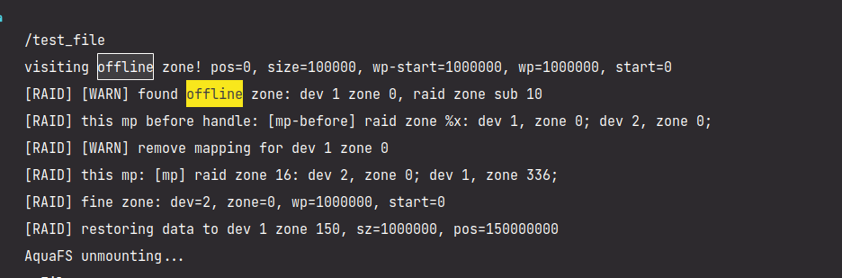

## TODO List

### RAID

- [ ] 完善数据恢复逻辑

  - [x] 当读写发现读写错误，且出错分区可以被数据恢复，则立即开始恢复数据。

  - [x] 先写入一个大文件，然后软件上设置一个块为 `Offline` ，然后在读取的过程中自动修复

    

- [ ] 添加 `io_uring` 等异步优化

  - [x] `liburing4cpp` 添加和测试
  - [x] 为全盘 RAID0 模式添加 `io_uring`
    1. 将一个请求划分到不同设备和分区并进行分组和排序
    2. 将请求参数加入 RingBuf，有并行和串行逻辑
    3. 请求并等待请求结束
  - [x] 为分区 RAID0 添加 `io_uring`
  - [x] 使用 C++20 的协程使 `io_uring` 请求更加并行化

- [ ] 测试

  - [x] 可量化的 RAID 效果测试：

    

    通过在读写函数中加上高精度延时模拟磁盘读写延迟。

- [ ] RAID5 逻辑

- [ ] 文档

  - [ ] **摘要**
  - [x] 概述
  - [ ] 需求分析与调研
    - [ ] 需求分析
    - [ ] 往年队伍实现的分析
    - [ ] 国内外其他研究
    - [ ] 将原来调研的文档改改格式加进来
  - [ ] 系统设计部分
  - [ ] 系统实现部分
